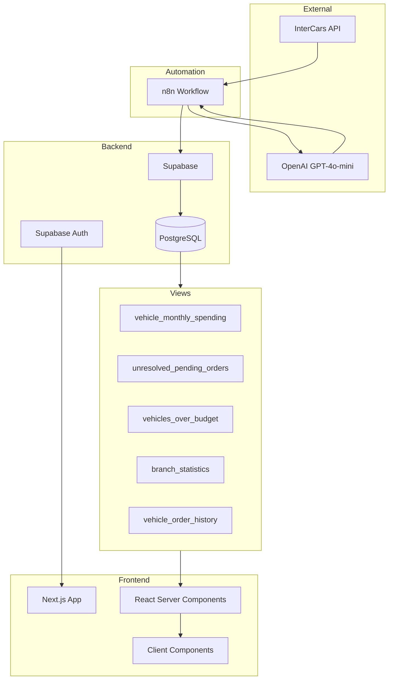
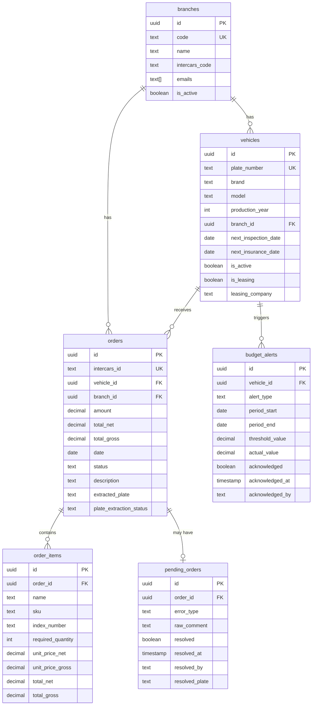
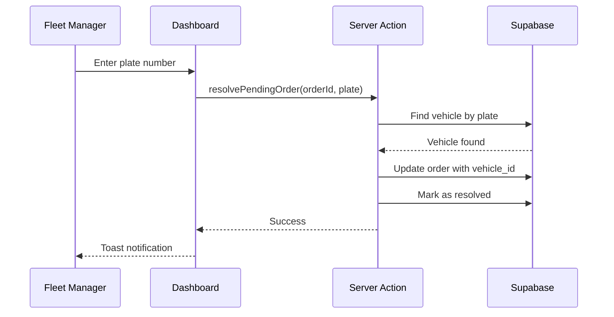
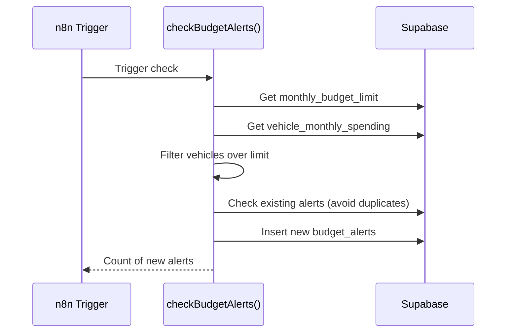

# Art-Tim Fleet Manager - Project Specification

> **Evergreen Documentation** | Last Updated: January 2026

---

## 1. Executive Summary

**Art-Tim Fleet Manager** is a comprehensive fleet management dashboard built for Art-Tim, a Polish fleet management company operating 150+ vehicles across 4 branches in Poland. The system enables real-time monitoring of vehicle parts purchases, expense tracking, budget management, and resolution of pending verification requests.

**Production URL:** https://art-tim.vercel.app (if deployed)  
**Database:** Supabase ([Art-Tim] Baza Samochodów)  
**Primary Language:** Polish

---

## 2. Business Objective

### The Problem

Art-Tim employees frequently order parts through InterCars (an automotive parts supplier), but orders often lack proper vehicle registration numbers in comments. This makes it impossible to:

- Track which parts are assigned to which vehicle
- Monitor per-vehicle spending
- Identify vehicles with unusually high maintenance costs
- Set and enforce budget limits

### The Solution

A dashboard that:

1. **Syncs orders automatically** via n8n workflows from InterCars API
2. **Extracts vehicle plates** using AI (GPT-4o-mini) from order comments
3. **Matches plates** to the vehicle database
4. **Queues unmatched orders** for manual resolution
5. **Alerts managers** when spending exceeds configurable thresholds
6. **Provides insights** into fleet spending patterns

---

## 3. Key Features

### 3.1 Dashboard Overview (`/`)

| Feature                      | Description                                            |
| ---------------------------- | ------------------------------------------------------ |
| **Summary Cards**            | Active vehicles, monthly orders, pending queue, alerts |
| **Expenses Chart**           | 6-month spending trend visualization                   |
| **Top Vehicles Table**       | 10 highest-spending vehicles this month                |
| **Recent Pending List**      | Latest 5 orders requiring verification                 |

### 3.2 Pending Orders Queue (`/pending`)

**Priority Feature** - Daily operational workflow for fleet managers.

- View orders missing valid vehicle plates
- See original comment and AI-extracted plate (if invalid)
- Quick assignment via vehicle dropdown + plate input
- Resolution tracking (who resolved, when)
- Filter by error type (missing/invalid)

### 3.3 Vehicle Management (`/vehicles`, `/vehicles/[id]`)

| View           | Features                                                                  |
| -------------- | ------------------------------------------------------------------------- |
| **List View**  | Filterable grid (search, branch, status), sortable columns               |
| **Detail View** | Vehicle info, 12-month spending chart, complete order history            |

**Vehicle Properties:**
- Plate number, brand, model, year
- Branch assignment
- Inspection/insurance dates
- Leasing information
- Activity status

### 3.4 Orders Management (`/orders`)

- Complete order history with full-text search
- Filters: date range, branch, status
- Sortable columns
- Order details with line items

### 3.5 Spending Reports (`/spending`)

- Current month spending per vehicle
- Ranked by total spent (descending)
- Linked to vehicle detail pages

### 3.6 Budget Alerts (`/alerts`)

- Vehicles exceeding monthly budget limit
- Acknowledgment workflow
- Linked to vehicle details for investigation

### 3.7 Settings (`/settings`)

- Configurable monthly budget limit per vehicle
- Stored in `system_settings` table

---

## 4. Technology Stack

### Frontend

| Technology       | Version    | Purpose                         |
| ---------------- | ---------- | ------------------------------- |
| **Next.js**      | 16.1.1     | React framework with App Router |
| **React**        | 19.2.3     | UI library                      |
| **TypeScript**   | 5.x        | Type safety                     |
| **Tailwind CSS** | 4.x        | Utility-first styling           |
| **Recharts**     | 3.6.0      | Data visualization              |
| **Radix UI**     | Latest     | Accessible UI primitives        |
| **Lucide React** | 0.562.0    | Icon library                    |
| **date-fns**     | 4.1.0      | Date manipulation               |

### Backend

| Technology            | Purpose                       |
| --------------------- | ----------------------------- |
| **Supabase**          | Database + Auth + API         |
| **PostgreSQL 17**     | Relational database           |
| **Row Level Security**| Data access control           |
| **n8n**               | Workflow automation           |

### Key Libraries

```json
{
  "@supabase/ssr": "^0.8.0",
  "@supabase/supabase-js": "^2.90.0",
  "class-variance-authority": "^0.7.1",
  "clsx": "^2.1.1",
  "tailwind-merge": "^3.4.0"
}
```

---

## 5. High-Level Architecture



### Data Flow

1. **n8n Daily Sync** → Fetches invoices from InterCars API
2. **AI Extraction** → GPT-4o-mini extracts plate numbers from comments  
3. **Plate Matching** → System matches to `vehicles` table
4. **Pending Queue** → Unmatched orders go to `pending_orders`
5. **Manual Resolution** → Fleet manager assigns vehicles via UI
6. **Budget Monitoring** → System checks against `monthly_budget_limit`

---

## 6. Database Schema

### Core Tables



### Supporting Tables

| Table             | Purpose                              | Rows   |
| ----------------- | ------------------------------------ | ------ |
| `branches`        | Company locations (WRO, KTW, etc.)  | 5      |
| `vehicles`        | Fleet vehicle registry              | 148    |
| `orders`          | Parts orders from InterCars         | Dynamic |
| `order_items`     | Line items within orders            | Dynamic |
| `pending_orders`  | Orders requiring plate verification | Dynamic |
| `budget_alerts`   | Spending threshold violations       | Dynamic |
| `sync_log`        | n8n sync history                    | Dynamic |
| `system_settings` | App configuration (budget limit)    | 1      |
| `profiles`        | User roles and branch assignments   | 1      |

### Pre-built Views

| View                       | Purpose                                |
| -------------------------- | -------------------------------------- |
| `vehicle_monthly_spending` | Monthly spending aggregated by vehicle |
| `unresolved_pending_orders`| Pending queue with joined order data  |
| `vehicles_over_budget`     | Vehicles exceeding monthly limit       |
| `branch_statistics`        | Per-branch summary metrics             |
| `vehicle_order_history`    | Last 12 months orders with details     |

---

## 7. Application Structure

```
art-tim/
├── app/
│   ├── page.tsx              # Dashboard
│   ├── layout.tsx            # Root layout with sidebar
│   ├── globals.css           # Global styles + glassmorphism
│   ├── actions/              # Server actions
│   │   ├── resolve-pending.ts
│   │   ├── check-budget.ts
│   │   ├── acknowledge-alert.ts
│   │   └── settings.ts
│   ├── alerts/page.tsx
│   ├── orders/page.tsx
│   ├── pending/page.tsx
│   ├── settings/page.tsx
│   ├── spending/page.tsx
│   ├── vehicles/
│   │   ├── page.tsx
│   │   └── [id]/page.tsx
│   └── login/
│       ├── page.tsx
│       └── actions.ts
├── components/
│   ├── dashboard/            # Dashboard widgets
│   ├── layout/               # Sidebar, Header
│   ├── vehicles/             # Vehicle components
│   ├── orders/               # Order components
│   ├── pending/              # Pending queue components
│   ├── alerts/               # Alert components
│   ├── settings/             # Settings form
│   └── ui/                   # Reusable UI primitives
├── utils/
│   ├── supabase/             # Supabase client setup
│   └── format.ts             # Formatting utilities
├── types/
│   └── supabase.ts           # Generated TypeScript types
├── lib/
│   └── utils.ts              # cn() helper
└── scripts/                  # Migration & seed scripts
```

---

## 8. UI/UX Design

### Design System

| Aspect            | Implementation                                    |
| ----------------- | ------------------------------------------------- |
| **Theme**         | Dark mode with glassmorphism                      |
| **Colors**        | Purple/pink gradient accents on dark backgrounds |
| **Typography**    | Inter font family                                 |
| **Icons**         | Lucide React                                      |
| **Responsive**    | Mobile-first, tablet-optimized for field use      |

### Key UI Patterns

- **Glass cards** (`.glass` class) with backdrop blur
- **Gradient accents** for branding
- **Subtle animations** (fade-in, pulse-glow)
- **Polish language labels** throughout

### Responsive Behavior

- **Mobile:** Collapsible sidebar, stacked layouts, horizontal scrolling tables
- **Tablet:** Optimized for fleet manager in-field use
- **Desktop:** Full sidebar, multi-column layouts

---

## 9. Authentication & Authorization

### Current Setup

- **Supabase Auth** with email/password
- **Row Level Security** enabled on all tables
- **Role-based access** via `profiles` table (`admin`, `manager`)
- Branch-scoped access for managers

### Login Flow

1. User navigates to `/login`
2. Email/password submitted to Supabase Auth
3. Session stored in cookies via `@supabase/ssr`
4. Protected routes check session on server

---

## 10. External Integrations

### InterCars API (via n8n)

| Aspect        | Detail                                    |
| ------------- | ----------------------------------------- |
| **Sync**      | Daily automated workflow                  |
| **Data**      | Invoices, line items                      |
| **Mapping**   | Branch code, amounts, dates              |

### OpenAI (via n8n)

| Aspect       | Detail                                             |
| ------------ | -------------------------------------------------- |
| **Model**    | GPT-4o-mini                                        |
| **Purpose**  | Extract plate numbers from order comments         |
| **Output**   | Plate or `missing`/`invalid` status               |

---

## 11. Branch Information

| Code | Name           | Description          |
| ---- | -------------- | -------------------- |
| WRO  | Wrocław        | Main headquarters    |
| KTW  | Katowice       | Regional branch      |
| LEG  | Legnica        | Regional branch      |
| JEL  | Jelenia Góra   | Regional branch      |
| NONE | Nieprzypisane  | Unassigned vehicles |

---

## 12. Development Workflow

### Local Development

```bash
# Install dependencies
npm install

# Start development server
npm run dev

# Build for production
npm run build

# Run linting
npm run lint
```

### Environment Variables

```env
NEXT_PUBLIC_SUPABASE_URL=https://bsqibeirdfjdphpyqnlx.supabase.co
NEXT_PUBLIC_SUPABASE_ANON_KEY=<your-anon-key>
```

### Supabase Type Generation

```bash
npx supabase gen types typescript --project-id bsqibeirdfjdphpyqnlx > types/supabase.ts
```

---

## 13. Key Workflows

### Pending Order Resolution



### Budget Alert Generation



---

## 14. Future Enhancements

### Planned (Post-MVP)

- [ ] Email notifications for pending orders
- [ ] Automatic anomaly detection (repeated part replacements)
- [ ] Integration with inspection/insurance reminders
- [ ] PDF report generation
- [ ] Multi-user access with full RBAC

### Technical Debt

- [ ] Add comprehensive error boundaries
- [ ] Implement optimistic updates for better UX
- [ ] Add end-to-end tests
- [ ] Set up CI/CD pipeline

---

## 15. Glossary

| Term                   | Definition                                          |
| ---------------------- | --------------------------------------------------- |
| **Pending Order**      | Order without valid vehicle plate assignment       |
| **Plate Extraction**   | AI process of finding plate number in comments     |
| **Budget Alert**       | Notification when vehicle spending exceeds limit   |
| **InterCars**          | Automotive parts supplier (external API)           |
| **Branch**             | Company location/office                             |

---

## 16. Contact & Ownership

| Role              | Contact                      |
| ----------------- | ---------------------------- |
| **Client**        | Art-Tim Fleet Management     |
| **Development**   | Fluinty (AI Automation)      |
| **Infrastructure**| Supabase + Vercel            |

---

*This document should be updated whenever significant changes are made to the system architecture, features, or integrations.*
